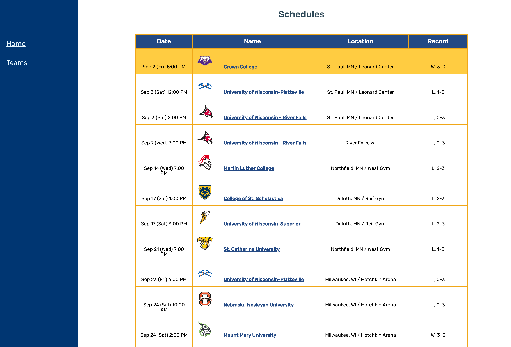
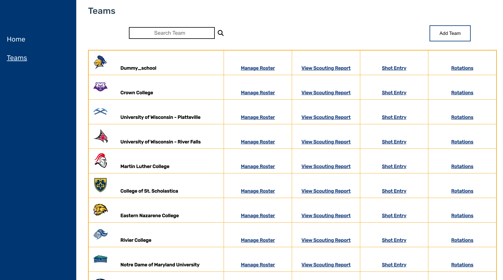
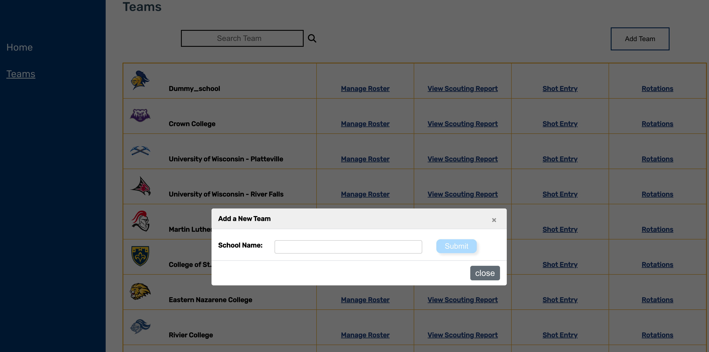
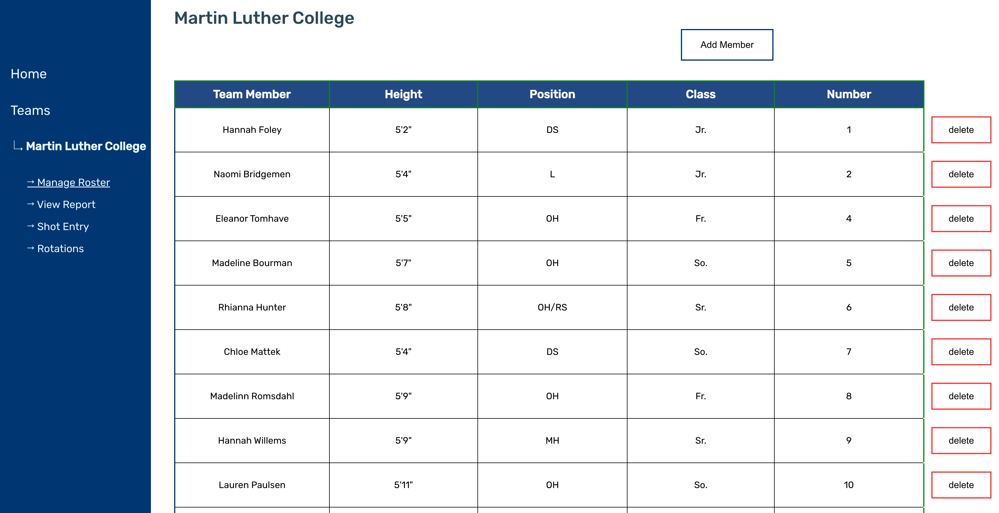
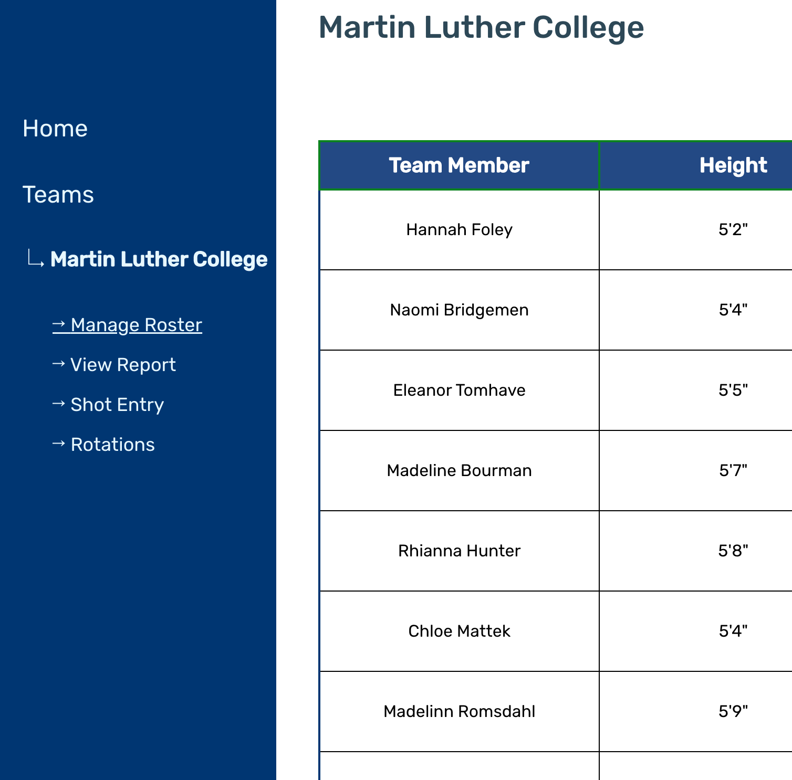
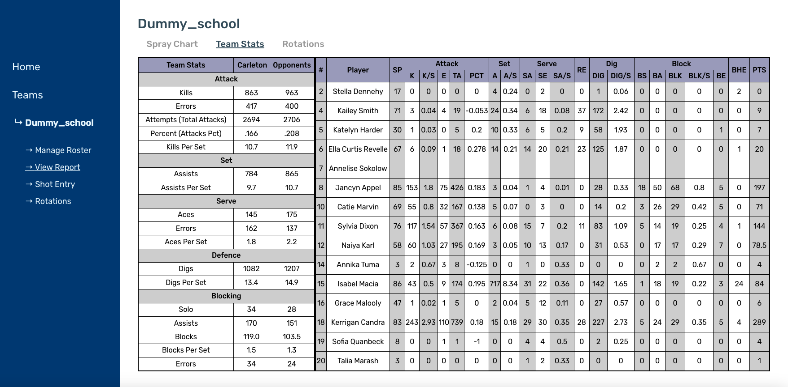

# VolleyComps-2.0

By: Eric Gassel, Joshua Song, Michael Dreger, Sam Gloss, Sam Rosenburg, Daniel Kim

# Frontend Documentation

## Home

The home page is where we can see the schedule of the Carleton Women's Volleyball team. 



User can click on the team name to directly go to the team's scouting report. 


## Teams

The teams page is where we can see all the teams that are part of NCAA D3. 



### Search Bar
User can use the search bar to search a team of choice. 

### Add Team



User can manually add a team by using the "Add Team" button.

### Manage Roster

User can click the manage roster button to navigate to a page that handles roster management. 



In this page, user can view, add and delete a member from the team's roster. 
The team's roster is dynamically rendered based on the saved data given from the server. 

### View Scouting Report

Clicking this button will directly lead the user to the team's scouting report. 

### Shot Entry

Clicking this button will directly lead the user to the team's shot entry page. 

### Rotations

Clicking this button will directly lead the user to the team's rotations page.

### Side Navigation Bar

Once a user is in a team specific page after clicking a button, the side navigation bar is activated for an easier navigation between pages.




## Scouting Report

The scouting report page is where we visualize our data for each team. There are three separate tabs in this page:

* Spray Chart
* Team Stats
* Rotations

#### Spray Chart

The Spray Chart tab shows the shots / serves of each players on the roster. It also has the note section to add comments on each player.


#### Team Stats

All the contents on this page are retrieved from the spreadsheet, which saves the scraped data from NCAA website. The table on the left side contains the overall team statistics on each categories (Attack / Set / Serve / Defense / Blocking). The table on the right side divides the data by each player, presenting individual statistics.




#### Rotations Tab

The Rotations tab renders all the saved rotations and the comments for each rotation. Each rotation contains the rotation squad, rotation chart, strategy notes, and other notes sections. Each dot/line on the chart is marked by player number and distinctive color. If we want to make an instant change, we can redirect to the Rotation Entry by clicking the button on the top-right or the side navigation.


## Shot Entry
The Shot Entry page is where you can enter shots for different players to then be viewed in the scouting report. To add a shot, follow these steps:

1. Select a date using the date selector in the top right (Note: This may be below the court depending on the size of your computer monitor). You may select any date, but this field was intended to be the date of the game for which the shot comes from. By selecting a date, you will filter all the shots to only display shots that occur on that specific date.
2. Select a player under "Shot Info".
3. Select shot options. This includes whether the shot was a Serve or a regular Shot, and if the shot was a Kill/Ace, Returned, or Out.
4. Next, select the starting and end spots for the shot on the court.
5. Press "ADD SHOT".

After pressing "ADD SHOT", the shot should display on the court. You can delete the shot by selecting the shot on the court and then pressing delete.

At any time you may press "Reset" which resets all selected options and currently selected spots on the court.

Hovering over "ADD SHOT" and "Delete" will give small reminders on how to add and delete a shot.

You may navigate to the Scouting Report and Rotation Entry pages via the navagation on the left of the screen or the buttons on the bottom right.

## Rotation Entry
The Rotation Entry page is where you can add rotations for a team. 
> The areas mentioned for selecting different parts of a rotation and adding/editing them may appear below the drawing box or to the right depending on your computer monitor. In this documentation, the area will be referred to as being on the right on the screen.

Initially, if there are no rotations added, to the right you will see text that says "No Rotations Added" and a button that says "Add Rotation". By pressing "Add Rotation" you will be able to add any player that has been added to the rotation by selecting the player and then selecting the spot in the rotation where you wish to add the player. Note, each player in the rotation has to be unique (i.e no duplicate players in the rotation). If there are less than 6 players available, the page will ask you to add players to the team.

After adding 6 players to a rotation, you will be brought to the Rotation Entry page. Here, you may add more rotations at the top of the section on the right. Additionally, you may edit the selected rotation by pressing the "Edit Rotation" button.

If multiple rotations are added, you can switch between them by selecting the button displaying the each added rotation number at the top of the section on the right.

To add a route for a rotation, follow these steps.
1. Select a player from the 6 players that are a part of the rotation.
2. Draw the route for the player in the box on the left of the screen by holding down right click to draw in the box.
3. Press the "Add Route" button.

To delete a route for a rotation, follow these steps:
1. Select a player with a route already drawn in the drawing box.
2. Press the "Delete Route" button.

When adding notes in the sections below the drawing box or below the players in the current rotation on the right hand of the screen, make sure to press the corresponding save button.

You may navigate to the Scouting Report and Shot Entry pages via the navagation on the left of the screen or the buttons on the bottom right.

# Backend Documentation

## VolleyVision API

Due to the length of this documentation, the Readme for the VolleyVision API can be found in [/backend/VolleyVision-API](https://github.com/ericgassel/VolleyComps-2.0/tree/main/backend/VolleyVision-API). This documentation contains very detailed instructions on how to interact with the API.

## Data Storage

The data base is composed of 429 (and counting) distinct Google Sheets files that each represent one team. For example, there will be a Google Sheets titled "St. Olaf", and another Google Sheets titled "Macalaster".

Each Google Sheets contain the following five sheets "pages":

- "roster"
    - columns in roster: [player_id, name, number, height, position, class, notes]
- "spray_chart"
    - columns in spray_chart: [player_id, type, result, start_x, start_y, end_x, end_y, date]
- "rotations"
    - columns in rotations: [rotation_number, line, notes, blocking_scheme, serve_recieve, transition]
- "team_stats"
    - [Team, Kills,	Errors,	Attempts, Percent,	Kills_Per_Set,	Assists, Assists_Per_Set, Ball_Handling_Errors, Aces, Errors, Aces_Per_Set, Errors, Errors_Per_Set, Digs, Digs_Per_Set, Solo, Assists, Errors, Blocks, Blocks_Per_Set]
- "ind_stats"
    -[Player_ID, Image, Season, Name, Number, Position(s), Height, Year, SP, MP, K, K/S, E, TA, PCT, A, A/S, SA, SA/S, SE, DIG, D/S, RE, BS, BA, TB, B/S, BE, BHE, PTS, PTS/S]
  
In addition the these spreadsheets, there is a "Schools" and  "Schedule" spreadsheet.
- "Schools" : contains the following 3 columns:
  - School Name
  - Spreadsheet ID for the school (which is how we store which spreadsheets represent which teams)
  - School Logo

- "Schedule" : contains the following 4 columns:
  - College Name
  - Date of Game
  - Location of Game
  - Game Result (if applicable)


## Scraping
The scrapig runs in two components. Volleyball Logos and VolleyScraperMain. Volleyball Logos is a once a year needed run. It gets the years list of teams, team logos, and school pages on the NCAA site. VolleyScraperMain is the meat of the scraping protocols and needs to be run daily during the Volleyball Season in order to give the most accurate and up to date information. 

VolleyScraperMain has a three of major functions:

  -Population of Carleton Schedule along with results

  -Creation of Every team in D3's spreadsheet with proper headers etc. 

  -Population of most teams rosters, individual statistics, and team statistics. 

All Data that is scraped is then stored on that individual teams spreadsheet which is on Google Sheets that the Scraper directly interacts with.


# How to start up the existing code

### Frontend
To start up the frontend of VolleyVision, first find the file in your command line interface.

At this point, on Mac, your terminal should look something like this:
(MacOS)
```sh
...[personal computer info] VolleyComps-2.0 %
```
or
(Windows)
```sh
...[personal computer info]/VolleyComps-2.0$
```

After reaching this point, run the following command in the terminal to get into the frontend folder:

```sh
cd frontend
```

Then, if this the first time completing these steps, install npm by running: 
```sh
npm install
```

Next, you should be able to start the project with:
```sh
npm start
```
If you get an error that says something along the lines of:
```sh
opensslErrorStack: [ 'error:03000086:digital envelope routines::initialization error' ],
  library: 'digital envelope routines',
  reason: 'unsupported',
  code: 'ERR_OSSL_EVP_UNSUPPORTED'
}
```
Run the following command in your terminal:
```sh
export NODE_OPTIONS=--openssl-legacy-provider
```
Then run the following command again:  
```sh
npm start
```

After following these steps, VolleyVision should open as a tab in your browser.

### Backend

## Running the VolleyVision API Locally

To run the API on your local machine, navigate to `VolleyComps-2.0/backend/VolleyVision-API` and run the command `npm run start`. 

You should have `nodemon` and `Node.js` installed on your machine.

*Please note that there are certain Wifi's, such as Carleton's eduroam, that contain certain firewalls that prevent my API from establishing a connection to the Google Sheets API, and thus the API won't work. This may be the case for you if your API calls are timing out.
